```mermaid
---
title: Ansible Playbook Grapher
---
%%{ init: { "flowchart": { "curve": "bumpX" } } }%%
flowchart LR
	%% Start of the playbook 'tests/fixtures/multi-plays.yml'
	playbook_d5b7b204("tests/fixtures/multi-plays.yml")
		%% Start of the play 'Play: all (0)'
		play_8675d2cb["Play: all (0)"]
		style play_8675d2cb fill:#bb5911,color:#ffffff
		playbook_d5b7b204 --> |"1"| play_8675d2cb
		linkStyle 0 stroke:#bb5911,color:#bb5911
			pre_task_bf106fae["[pre_task]  Pretask"]
			style pre_task_bf106fae stroke:#bb5911,fill:#ffffff
			play_8675d2cb --> |"1"| pre_task_bf106fae
			linkStyle 1 stroke:#bb5911,color:#bb5911
			pre_task_af7f2dfe["[pre_task]  Pretask 2"]
			style pre_task_af7f2dfe stroke:#bb5911,fill:#ffffff
			play_8675d2cb --> |"2"| pre_task_af7f2dfe
			linkStyle 2 stroke:#bb5911,color:#bb5911
			%% Start of the role 'fake_role'
			play_8675d2cb --> |"3"| role_4402808c
			linkStyle 3 stroke:#bb5911,color:#bb5911
			role_4402808c(["[role] fake_role"])
			style role_4402808c fill:#bb5911,color:#ffffff,stroke:#bb5911
				task_23c06dad[" fake_role : Debug 1"]
				style task_23c06dad stroke:#bb5911,fill:#ffffff
				role_4402808c --> |"1 [when: ansible_distribution == 'Debian']"| task_23c06dad
				linkStyle 4 stroke:#bb5911,color:#bb5911
				task_65fef46c[" fake_role : Debug 2"]
				style task_65fef46c stroke:#bb5911,fill:#ffffff
				role_4402808c --> |"2 [when: ansible_distribution == 'Debian']"| task_65fef46c
				linkStyle 5 stroke:#bb5911,color:#bb5911
				task_0a1590a1[" fake_role : Debug 3 with double quote &#34;here&#34; in the name"]
				style task_0a1590a1 stroke:#bb5911,fill:#ffffff
				role_4402808c --> |"3 [when: ansible_distribution == 'Debian']"| task_0a1590a1
				linkStyle 6 stroke:#bb5911,color:#bb5911
			%% End of the role 'fake_role'
			%% Start of the role 'display_some_facts'
			play_8675d2cb --> |"4"| role_32b5ac2f
			linkStyle 7 stroke:#bb5911,color:#bb5911
			role_32b5ac2f(["[role] display_some_facts"])
			style role_32b5ac2f fill:#bb5911,color:#ffffff,stroke:#bb5911
				task_71e941a2[" display_some_facts : ansible_architecture"]
				style task_71e941a2 stroke:#bb5911,fill:#ffffff
				role_32b5ac2f --> |"1"| task_71e941a2
				linkStyle 8 stroke:#bb5911,color:#bb5911
				task_9dce7b72[" display_some_facts : ansible_date_time"]
				style task_9dce7b72 stroke:#bb5911,fill:#ffffff
				role_32b5ac2f --> |"2"| task_9dce7b72
				linkStyle 9 stroke:#bb5911,color:#bb5911
				task_0ce82ea4[" display_some_facts : Specific included task for Debian"]
				style task_0ce82ea4 stroke:#bb5911,fill:#ffffff
				role_32b5ac2f --> |"3"| task_0ce82ea4
				linkStyle 10 stroke:#bb5911,color:#bb5911
			%% End of the role 'display_some_facts'
			task_d6e309de["[task]  Add backport {{backport}}"]
			style task_d6e309de stroke:#bb5911,fill:#ffffff
			play_8675d2cb --> |"5"| task_d6e309de
			linkStyle 11 stroke:#bb5911,color:#bb5911
			task_1ae0e734["[task]  Install packages"]
			style task_1ae0e734 stroke:#bb5911,fill:#ffffff
			play_8675d2cb --> |"6"| task_1ae0e734
			linkStyle 12 stroke:#bb5911,color:#bb5911
			post_task_d322ca69["[post_task]  Posttask"]
			style post_task_d322ca69 stroke:#bb5911,fill:#ffffff
			play_8675d2cb --> |"7"| post_task_d322ca69
			linkStyle 13 stroke:#bb5911,color:#bb5911
			post_task_38ae6bb3["[post_task]  Posttask 2"]
			style post_task_38ae6bb3 stroke:#bb5911,fill:#ffffff
			play_8675d2cb --> |"8"| post_task_38ae6bb3
			linkStyle 14 stroke:#bb5911,color:#bb5911
		%% End of the play 'Play: all (0)'
		%% Start of the play 'Play: database (0)'
		play_a824267c["Play: database (0)"]
		style play_a824267c fill:#be840e,color:#ffffff
		playbook_d5b7b204 --> |"2"| play_a824267c
		linkStyle 15 stroke:#be840e,color:#be840e
			%% Start of the role 'fake_role'
			play_a824267c --> |"1"| role_bdfbf3fb
			linkStyle 16 stroke:#be840e,color:#be840e
			role_bdfbf3fb(["[role] fake_role"])
			style role_bdfbf3fb fill:#be840e,color:#ffffff,stroke:#be840e
				task_cfc785a5[" fake_role : Debug 1"]
				style task_cfc785a5 stroke:#be840e,fill:#ffffff
				role_bdfbf3fb --> |"1 [when: ansible_distribution == 'Debian']"| task_cfc785a5
				linkStyle 17 stroke:#be840e,color:#be840e
				task_c0770f6a[" fake_role : Debug 2"]
				style task_c0770f6a stroke:#be840e,fill:#ffffff
				role_bdfbf3fb --> |"2 [when: ansible_distribution == 'Debian']"| task_c0770f6a
				linkStyle 18 stroke:#be840e,color:#be840e
				task_97973229[" fake_role : Debug 3 with double quote &#34;here&#34; in the name"]
				style task_97973229 stroke:#be840e,fill:#ffffff
				role_bdfbf3fb --> |"3 [when: ansible_distribution == 'Debian']"| task_97973229
				linkStyle 19 stroke:#be840e,color:#be840e
			%% End of the role 'fake_role'
			%% Start of the role 'display_some_facts'
			play_a824267c --> |"2"| role_e98b6ecb
			linkStyle 20 stroke:#be840e,color:#be840e
			role_e98b6ecb(["[role] display_some_facts"])
			style role_e98b6ecb fill:#be840e,color:#ffffff,stroke:#be840e
				task_cf84ebb9[" display_some_facts : ansible_architecture"]
				style task_cf84ebb9 stroke:#be840e,fill:#ffffff
				role_e98b6ecb --> |"1"| task_cf84ebb9
				linkStyle 21 stroke:#be840e,color:#be840e
				task_297330d7[" display_some_facts : ansible_date_time"]
				style task_297330d7 stroke:#be840e,fill:#ffffff
				role_e98b6ecb --> |"2"| task_297330d7
				linkStyle 22 stroke:#be840e,color:#be840e
				task_7588f2aa[" display_some_facts : Specific included task for Debian"]
				style task_7588f2aa stroke:#be840e,fill:#ffffff
				role_e98b6ecb --> |"3"| task_7588f2aa
				linkStyle 23 stroke:#be840e,color:#be840e
			%% End of the role 'display_some_facts'
		%% End of the play 'Play: database (0)'
		%% Start of the play 'Play: webserver (0)'
		play_f55f065e["Play: webserver (0)"]
		style play_f55f065e fill:#15b798,color:#ffffff
		playbook_d5b7b204 --> |"3"| play_f55f065e
		linkStyle 24 stroke:#15b798,color:#15b798
			%% Start of the role 'nested_include_role'
			play_f55f065e --> |"1"| role_14a2f4f8
			linkStyle 25 stroke:#15b798,color:#15b798
			role_14a2f4f8(["[role] nested_include_role"])
			style role_14a2f4f8 fill:#15b798,color:#ffffff,stroke:#15b798
				task_091dd98d[" nested_include_role : Ensure postgresql is at the latest version"]
				style task_091dd98d stroke:#15b798,fill:#ffffff
				role_14a2f4f8 --> |"1"| task_091dd98d
				linkStyle 26 stroke:#15b798,color:#15b798
				task_344d9468[" nested_include_role : Ensure that postgresql is started"]
				style task_344d9468 stroke:#15b798,fill:#ffffff
				role_14a2f4f8 --> |"2"| task_344d9468
				linkStyle 27 stroke:#15b798,color:#15b798
				%% Start of the role 'display_some_facts'
				role_14a2f4f8 --> |"3 [when: x is not defined]"| role_63f4df20
				linkStyle 28 stroke:#15b798,color:#15b798
				role_63f4df20(["[role] display_some_facts"])
				style role_63f4df20 fill:#15b798,color:#ffffff,stroke:#15b798
					task_317db5e6[" display_some_facts : ansible_architecture"]
					style task_317db5e6 stroke:#15b798,fill:#ffffff
					role_63f4df20 --> |"1"| task_317db5e6
					linkStyle 29 stroke:#15b798,color:#15b798
					task_69e11af2[" display_some_facts : ansible_date_time"]
					style task_69e11af2 stroke:#15b798,fill:#ffffff
					role_63f4df20 --> |"2"| task_69e11af2
					linkStyle 30 stroke:#15b798,color:#15b798
					task_2ff7dd92[" display_some_facts : Specific included task for Debian"]
					style task_2ff7dd92 stroke:#15b798,fill:#ffffff
					role_63f4df20 --> |"3"| task_2ff7dd92
					linkStyle 31 stroke:#15b798,color:#15b798
				%% End of the role 'display_some_facts'
				%% Start of the role 'fake_role'
				role_14a2f4f8 --> |"4"| role_4e9fc5c1
				linkStyle 32 stroke:#15b798,color:#15b798
				role_4e9fc5c1(["[role] fake_role"])
				style role_4e9fc5c1 fill:#15b798,color:#ffffff,stroke:#15b798
					task_7ecbc842[" fake_role : Debug 1"]
					style task_7ecbc842 stroke:#15b798,fill:#ffffff
					role_4e9fc5c1 --> |"1"| task_7ecbc842
					linkStyle 33 stroke:#15b798,color:#15b798
					task_4207343a[" fake_role : Debug 2"]
					style task_4207343a stroke:#15b798,fill:#ffffff
					role_4e9fc5c1 --> |"2"| task_4207343a
					linkStyle 34 stroke:#15b798,color:#15b798
					task_8e980b40[" fake_role : Debug 3 with double quote &#34;here&#34; in the name"]
					style task_8e980b40 stroke:#15b798,fill:#ffffff
					role_4e9fc5c1 --> |"3"| task_8e980b40
					linkStyle 35 stroke:#15b798,color:#15b798
				%% End of the role 'fake_role'
			%% End of the role 'nested_include_role'
			%% Start of the role 'display_some_facts'
			play_f55f065e --> |"2"| role_cd38738f
			linkStyle 36 stroke:#15b798,color:#15b798
			role_cd38738f(["[role] display_some_facts"])
			style role_cd38738f fill:#15b798,color:#ffffff,stroke:#15b798
				task_67fbb657[" display_some_facts : ansible_architecture"]
				style task_67fbb657 stroke:#15b798,fill:#ffffff
				role_cd38738f --> |"1"| task_67fbb657
				linkStyle 37 stroke:#15b798,color:#15b798
				task_ea07b561[" display_some_facts : ansible_date_time"]
				style task_ea07b561 stroke:#15b798,fill:#ffffff
				role_cd38738f --> |"2"| task_ea07b561
				linkStyle 38 stroke:#15b798,color:#15b798
				task_901f2d17[" display_some_facts : Specific included task for Debian"]
				style task_901f2d17 stroke:#15b798,fill:#ffffff
				role_cd38738f --> |"3"| task_901f2d17
				linkStyle 39 stroke:#15b798,color:#15b798
			%% End of the role 'display_some_facts'
		%% End of the play 'Play: webserver (0)'
	%% End of the playbook 'tests/fixtures/multi-plays.yml'


```

# Ansible Playbook Grapher


[](https://badge.fury.io/py/ansible-playbook-grapher)
[](https://coveralls.io/github/haidaraM/ansible-playbook-grapher?branch=main)

[ansible-playbook-grapher](https://github.com/haidaraM/ansible-playbook-grapher) is a command line tool to create a
graph representing your Ansible playbooks, plays, tasks and roles. The aim of this project is to have an overview of
your playbooks that you can use as documentation.

Inspired by [Ansible Inventory Grapher](https://github.com/willthames/ansible-inventory-grapher).

## Features

- Multiple [rendering formats](#renderers): graphviz, mermaid and JSON.
- Automatically find all your installed roles and collection.
- Native support for Ansible filters based on tags.
- Variables interpolation (when possible).
- Support for `import_*` and `include_*`.
- Multiple flags to hide empty plays, group roles by name, etc...
- Support for playbooks in collections.

The following features are available when opening the SVGs in a browser (recommended) or a viewer that supports
JavaScript:

- Highlighting of all the related nodes of a given node when clicking or hovering. Example: Click on a role to select
  all its tasks when `--include-role-tasks` is set.
- A double click on a node opens the corresponding file or folder depending on whether it's a playbook, a play, a task
  or a role. By default, the browser will open folders and download files since it may not be able to render the YAML
  file.  
  Optionally, you can
  set [the open protocol to use VSCode](https://code.visualstudio.com/docs/editor/command-line#_opening-vs-code-with-urls)
  with `--open-protocol-handler vscode`: it will open the folders when double-clicking on roles (not `include_role`) and
  the files for the other nodes. The cursor will be at the task exact position in the file.  
  Lastly, you can provide your own protocol formats
  with `--open-protocol-handler custom --open-protocol-custom-formats '{}'`. See the help
  and [an example.](https://github.com/haidaraM/ansible-playbook-grapher/blob/34e0aef74b82808dceb6ccfbeb333c0b531eac12/ansibleplaybookgrapher/renderer/__init__.py#L32-L41)
- Export the dot file used to generate the graph with Graphviz.

## Prerequisites

- Python 3.11 at least. It might work with previous versions, but the code is NOT tested against them.
  See [support matrix](https://docs.ansible.com/ansible/latest/reference_appendices/release_and_maintenance.html#ansible-core-support-matrix).
- A virtual environment from which to run the grapher. This is **highly recommended** because the grapher depends on
  some versions of ansible-core which are not necessarily installed in your environment and may cause issues if you use
  some older versions of Ansible (
  since `ansible` [package has been split](https://www.ansible.com/blog/ansible-3.0.0-qa)).
- **Graphviz**: The tool used to generate the graph in SVG. Optional if you don't plan to use the `graphviz` renderer.
  ```shell script
  sudo apt-get install graphviz # or yum install or brew install
  ```

I try to respect [Red Hat Ansible Engine Life Cycle](https://access.redhat.com/support/policy/updates/ansible-engine)
for the supported Ansible version.

## Installation

```shell
pip install ansible-playbook-grapher
```

You can also install the unpublished version from GitHub direction. Examples:

```shell
# Install the version from the main branch
pip install "ansible-playbook-grapher @ git+https://github.com/haidaraM/ansible-playbook-grapher"

# Install the version from a specific branch
pip install "ansible-playbook-grapher @ git+https://github.com/haidaraM/ansible-playbook-grapher@specific-branch"
```

### Renderers

At the time of writing, two renderers are supported:

1. `graphviz` (default): Generate the graph in SVG. Has more features than the other renderers.
2. `mermaid-flowchart`: Generate the graph in [Mermaid](https://mermaid.js.org/syntax/flowchart.html) format. You can
   directly embed the graph in your Markdown and GitHub (
   and [other integrations](https://mermaid.js.org/ecosystem/integrations.html)) will render it.
3. `json`: Generate a JSON representation of the graph to be used by other tools. The corresponding JSON schema
   is [here.](https://github.com/haidaraM/ansible-playbook-grapher/tree/main/tests/fixtures/json-schemas)

If you are interested to support more renderers, feel free to create an issue or raise a PR based on the existing
renderers.

## Usage

```shell
ansible-playbook-grapher tests/fixtures/example.yml
```


```shell
ansible-playbook-grapher --include-role-tasks  tests/fixtures/with_roles.yml
```


```shell
ansible-playbook-grapher tests/fixtures/with_block.yml
```


```shell
ansible-playbook-grapher --include-role-tasks --renderer mermaid-flowchart tests/fixtures/multi-plays.yml
```



```shell
ansible-playbook-grapher --renderer json tests/fixtures/simple_playbook.yml
```

<details> 

<summary>Json output</summary>

```json
{
  "version": 1,
  "playbooks": [
    {
      "type": "PlaybookNode",
      "id": "playbook_e4dc5cb3",
      "name": "tests/fixtures/simple_playbook.yml",
      "when": "",
      "index": 1,
      "location": {
        "type": "file",
        "path": "/Users/mohamedelmouctarhaidara/projects/ansible-playbook-grapher/tests/fixtures/simple_playbook.yml",
        "line": 1,
        "column": 1
      },
      "plays": [
        {
          "type": "PlayNode",
          "id": "play_1c544613",
          "name": "Play: all (0)",
          "when": "",
          "index": 1,
          "location": {
            "type": "file",
            "path": "/Users/mohamedelmouctarhaidara/projects/ansible-playbook-grapher/tests/fixtures/simple_playbook.yml",
            "line": 2,
            "column": 3
          },
          "post_tasks": [
            {
              "type": "TaskNode",
              "id": "post_task_a9b2e9ac",
              "name": "Post task 1",
              "when": "",
              "index": 1,
              "location": {
                "type": "file",
                "path": "/Users/mohamedelmouctarhaidara/projects/ansible-playbook-grapher/tests/fixtures/simple_playbook.yml",
                "line": 4,
                "column": 7
              }
            },
            {
              "type": "TaskNode",
              "id": "post_task_61204621",
              "name": "Post task 2",
              "when": "",
              "index": 2,
              "location": {
                "type": "file",
                "path": "/Users/mohamedelmouctarhaidara/projects/ansible-playbook-grapher/tests/fixtures/simple_playbook.yml",
                "line": 7,
                "column": 7
              }
            }
          ],
          "pre_tasks": [],
          "roles": [],
          "tasks": [],
          "hosts": [],
          "colors": {
            "main": "#585874",
            "font": "#ffffff"
          }
        }
      ]
    }
  ]
}
```

</details>

Note on block: Since a `block` is a logical group of tasks, the conditional `when` is not displayed on the edges
pointing to them but on the tasks inside the block. This
mimics [Ansible behavior](https://docs.ansible.com/ansible/latest/user_guide/playbooks_blocks.html#grouping-tasks-with-blocks)
regarding the blocks.

### CLI options

The available options:

```
usage: ansible-playbook-grapher [-h] [-v] [-i INVENTORY] [--include-role-tasks] [-s] [--view] [-o OUTPUT_FILENAME]
                                [--open-protocol-handler {default,vscode,custom}] [--open-protocol-custom-formats OPEN_PROTOCOL_CUSTOM_FORMATS]
                                [--group-roles-by-name] [--renderer {graphviz,mermaid-flowchart,json}] [--renderer-mermaid-directive RENDERER_MERMAID_DIRECTIVE]
                                [--renderer-mermaid-orientation {TD,RL,BT,RL,LR}] [--version] [--hide-plays-without-roles] [--hide-empty-plays] [-t TAGS]
                                [--skip-tags SKIP_TAGS] [--vault-id VAULT_IDS] [-J | --vault-password-file VAULT_PASSWORD_FILES] [-e EXTRA_VARS]
                                playbooks [playbooks ...]

Make graphs from your Ansible Playbooks.

positional arguments:
  playbooks             Playbook(s) to graph. You can specify multiple playbooks, separated by spaces and reference playbooks in collections.

options:
  --exclude-roles EXCLUDE_ROLES
			Specifiy file path or comma separated list of roles, which should be excluded. This argument may be specified multiple times.
  --group-roles-by-name
                        When rendering the graph (graphviz and mermaid), only a single role will be displayed for all roles having the same names. Default: False
  --hide-empty-plays    Hide the plays that end up with no tasks in the graph (after applying the tags filter).
  --hide-plays-without-roles
                        Hide the plays that end up with no roles in the graph (after applying the tags filter). Only roles at the play level and include_role as tasks are
                        considered (no import_role).
  --include-role-tasks  Include the tasks of the roles in the graph. Applied when parsing the playbooks.
  --open-protocol-custom-formats OPEN_PROTOCOL_CUSTOM_FORMATS
                        The custom formats to use as URLs for the nodes in the graph. Required if --open-protocol-handler is set to custom. You should provide a
                        JSON formatted string like: {"file": "", "folder": ""}. Example: If you want to open folders (roles) inside the browser and files
                        (tasks) in vscode, set it to: '{"file": "vscode://file/{path}:{line}:{column}", "folder": "{path}"}'. path: the absolute path to the
                        file containing the the plays/tasks/roles. line/column: the position of the plays/tasks/roles in the file. You can optionally add the
                        attribute "remove_from_path" to remove some parts of the path if you want relative paths.
  --open-protocol-handler {default,vscode,custom}
                        The protocol to use to open the nodes when double-clicking on them in your SVG viewer (only for graphviz). Your SVG viewer must support
                        double-click and Javascript. The supported values are 'default', 'vscode' and 'custom'. For 'default', the URL will be the path to the
                        file or folders. When using a browser, it will open or download them. For 'vscode', the folders and files will be open with VSCode. For
                        'custom', you need to set a custom format with --open-protocol-custom-formats.
  --renderer {graphviz,mermaid-flowchart,json}
                        The renderer to use to generate the graph. Default: graphviz
  --renderer-mermaid-directive RENDERER_MERMAID_DIRECTIVE
                        The directive for the mermaid renderer. Can be used to customize the output: fonts, theme, curve etc. More info at
                        https://mermaid.js.org/config/directives.html. Default: '%%{ init: { "flowchart": { "curve": "bumpX" } } }%%'
  --renderer-mermaid-orientation {TD,RL,BT,RL,LR}
                        The orientation of the flow chart. Default: 'LR'
  --skip-tags SKIP_TAGS
                        only run plays and tasks whose tags do not match these values. This argument may be specified multiple times.
  --vault-id VAULT_IDS  the vault identity to use. This argument may be specified multiple times.
  --vault-password-file VAULT_PASSWORD_FILES, --vault-pass-file VAULT_PASSWORD_FILES
                        vault password file
  --version
  --view                Automatically open the resulting SVG file with your system's default viewer application for the file type
  -J, --ask-vault-password, --ask-vault-pass
                        ask for vault password
  -e EXTRA_VARS, --extra-vars EXTRA_VARS
                        set additional variables as key=value or YAML/JSON, if filename prepend with @. This argument may be specified multiple times.
  -h, --help            show this help message and exit
  -i INVENTORY, --inventory INVENTORY
                        Specify inventory host path or comma separated host list. This argument may be specified multiple times.
  -o OUTPUT_FILENAME, --output-file-name OUTPUT_FILENAME
                        Output filename without the '.svg' extension (for graphviz), '.mmd' for Mermaid or `.json`. The extension will be added automatically.
  -s, --save-dot-file   Save the graphviz dot file used to generate the graph.
  -t TAGS, --tags TAGS  only run plays and tasks tagged with these values. This argument may be specified multiple times.
  -v, --verbose         Causes Ansible to print more debug messages. Adding multiple -v will increase the verbosity, the builtin plugins currently evaluate up
                        to -vvvvvv. A reasonable level to start is -vvv, connection debugging might require -vvvv. This argument may be specified multiple
                        times.
```

## Configuration: ansible.cfg

The content of `ansible.cfg` is loaded automatically when running the grapher according to Ansible's behavior. The
corresponding environment variables are also loaded.

The values in the config file (and their corresponding environment variables) may affect the behavior of the grapher.
For example `TAGS_RUN` and `TAGS_SKIP` or vault configuration.

More information [here](https://docs.ansible.com/ansible/latest/reference_appendices/config.html).

## Limitations

- Since Ansible Playbook Grapher is a static analyzer that parses your playbook, it's limited to what can be determined
  statically: no task is run against your inventory. The parser tries to interpolate the variables, but some of them are
  only available when running your playbook ( `ansible_os_family`, `ansible_system`, etc.). The tasks inside any
  `import_*` or `include_*` with some variables in their arguments may not appear in the graph.
- The rendered SVG graph may sometime display tasks in a wrong order. I cannot control this behavior of Graphviz yet.
  Always check the edge label to know the task order.
- The label of the edges may overlap with each other. They are positioned so that they are as close as possible to
  the target nodes. If the same role is used in multiple plays or playbooks, the labels can overlap.

## Contribution

Contributions are welcome. Feel free to contribute by creating an issue or submitting a PR :smiley:

### Local development

To set up a new local development environment:

- Install graphviz (see above)
- pip install -r requirements.txt -r tests/requirements_tests.txt
- (cd tests/fixtures && ansible-galaxy install -r requirements.yml)

> The project contains some collections in [collections](tests/fixtures/collections). If you modify them, you need to do
> a force install with `ansible-galaxy install -r requirements.yml --force`

Run the tests and open the generated files in your system’s default viewer application:

```shell script
export TEST_VIEW_GENERATED_FILE=1
make test # run all tests
```

The graphs are generated in the folders `tests/generated-svgs`, `tests/generated-mermaids` and `tests/generated-jsons`.
They are also generated as artifacts in [GitHub Actions](https://github.com/haidaraM/ansible-playbook-grapher/actions).
Feel free to look at them when submitting PRs.

### Lint and format

The project uses ruff to format and lint the code. Run `make lint` to format and lint.

## License

GNU General Public License v3.0 or later (Same as Ansible)

See [LICENSE](./LICENSE) for the full text
