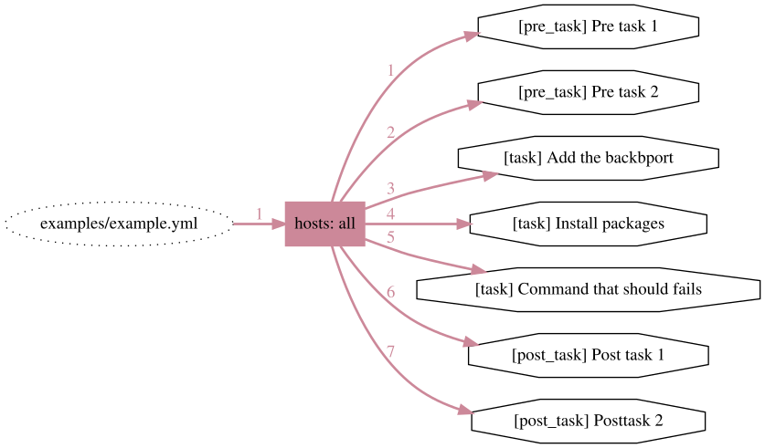

# Ansible Playbook Grapher

ansible-playbook-grapher is a command line tool to create a graph representing your Ansible playbook tasks and roles. The aim of
this project is to quickly have an overview of your playbook.

Inspired by [Ansible Inventory Grapher](https://github.com/willthames/ansible-inventory-grapher).

## Pérequis
 * **Ansible** >= 2.4: The script has not been tested yet with an earlier version of Ansible. 
 ```
 $ sudo pip3 install 'ansible>=2.4'
 ```
 * **graphviz**: The tool used to generate the graph in SVG. 
 ```
 sudo apt-get install graphviz
 ```
 
## Installation
```
$ sudo pip3 install ansible-playbook-grapher
```

## Usage

```
$ ansible-playbook-grapher examples/playbook.yml
```



Some options are available:

```
$ ansible-playbook-grapher --help
usage: ansible-playbook-grapher [-h] [-i INVENTORY] [--include-role-tasks]
                                [--save-dot-file] [-V]
                                playbook

Simple grapher for an Ansible Playbook. You will need to install Ansible,
graphviz on your system (sudo apt-get install graphviz). Has been tested with
Ansible 2.4.

positional arguments:
  playbook              The playbook to grah.

optional arguments:
  -h, --help            show this help message and exit
  -i INVENTORY, --inventory INVENTORY
                        The inventory. Useful if you want to have a tooltip
                        with hostnames on the play nodes.
  --include-role-tasks  Include tasks of the role in the graph. Can produce a
                        big graph if you have lot of roles.
  --save-dot-file       Save the dot file used to generate the graph.
  -V, --version         Print version and exits

```


## TODO

 - More colors: For the moment, a random color is chosen from a set of defined colors for each play
 found in the playbook. Maybe generate some colors specific automatically for each play.
 - Graphviz : properly rank the edge of the graph to represent the order of the execution of the tasks and roles
 - Graphviz : find a way to avoid edges overlapping
 - Ansible: Variables interpolation in node name (when possible)
  